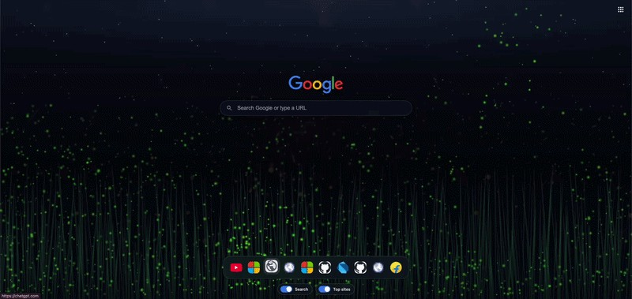

# fireflies-extension

**Night Field & Fireflies** — Chrome extension. Replaces the **new tab** page with the grass field scene: swaying grass and creatures that rest in the grass until you move the pointer over the field—then nearby ones drift upward and fade toward the sky.

  

## Privacy & Chrome Web Store

- **[Privacy policy](PRIVACY.md)** — public URL for Chrome (works without Pages):  
  **https://github.com/sharmark9931/fireflies-extension/blob/main/PRIVACY.md**
- **[Permission justifications](PERMISSIONS.md)** — copy-paste text for `tabs` and `topSites`
- **HTML privacy page** (after you turn on GitHub Pages — see below):  
  **https://sharmark9931.github.io/fireflies-extension/privacy-policy.html**

### Enable GitHub Pages (fixes 404 on the HTML URL)

The site **is not live until** you enable Pages on the repo (one-time):

**Option A — simplest (branch + `/docs`)**

1. Open **https://github.com/sharmark9931/fireflies-extension/settings/pages**
2. Under **Build and deployment** → **Source**, choose **Deploy from a branch**
3. Branch: **main** → Folder: **/docs** → **Save**
4. Wait ~1 minute, then open  
   **https://sharmark9931.github.io/fireflies-extension/privacy-policy.html**

**Option B — GitHub Actions** (uses `.github/workflows/pages.yml`)

1. Same **Settings → Pages**
2. **Source** → **GitHub Actions**
3. Accept the suggested “Deploy static content” / Pages workflow if prompted, or use the workflow already in this repo
4. Push to `main` or run **Actions → Deploy GitHub Pages → Run workflow**

Until Pages is enabled, use the **blob** link to `PRIVACY.md` above for the Chrome listing.

## Install (load unpacked)

1. Open `chrome://extensions`
2. Enable **Developer mode**
3. Click **Load unpacked**
4. Choose this folder: `fireflies`

## Dark vs light (system UI theme)

The page follows **`prefers-color-scheme`** (your OS/browser light or dark setting):

| Theme | Look | Creatures |
|--------|------|-----------|
| **Dark** | Night field, stars, cool sky glow | **Fireflies** (soft green glow) |
| **Light** | Day field, warm sun-like sky | **Butterflies** (small to large, wing flap; same hover → fly → fade behavior) |

Changing the system or browser theme updates the new tab automatically.

## Behavior

- **Grass**: Same blade layer in both themes (colors adjust). Blades sway in idle mode and lean smoothly when the pointer moves over the grass.
- **Creatures**: Many idle fireflies / butterflies (~1280), **biased toward the lower grass** so the field feels fuller near the ground. With the pointer over the grass, creatures within ~160px launch upward with smooth paths; brightness fades slowly as they rise. They respawn in the grass after disappearing.

## Top bar (Google apps)

The **top-right** **nine-dot** button opens a launcher with Google services (Search, YouTube, Gmail, Maps, Drive, Calendar, Photos, Docs, Sheets, Slides, Meet, Chat, Contacts, Keep, Sites, Forms, Classroom). Icons load from **Google’s favicon service** and **gstatic** product artwork. Each shortcut opens in a **new tab**.

## Center search & bottom dock

- **Google Search** — Centered logo and search box; submits to Google (`GET` `https://www.google.com/search?q=…`) in the **current tab**.
- **Top sites** — A **Mac-style** pill tray at the bottom lists **Chrome most-visited** sites (`chrome.topSites`), with favicons. Up to 12 entries.
- **Toggles** (bottom center) — **Search** and **Top sites** switch each section on or off. Choices are saved in **`localStorage`** (`ntp_showSearch`, `ntp_showTopSites`).

Reload the extension on `chrome://extensions` after updates.

## Files

- `manifest.json` — Manifest V3, `chrome_url_overrides.newtab`, `tabs` + `topSites` permissions
- `newtab.html` — Scene + apps launcher markup
- `styles.css` — Day/night layout, atmosphere, top bar
- `topbar.js` — Apps dropdown and links
- `ntp-ui.js` — Search hub, top sites dock, toggles, `localStorage`
- `scene.js` — Theme detection, creatures, grass rustle
- `assets/field.png` — Base field photograph (replace to customize)
